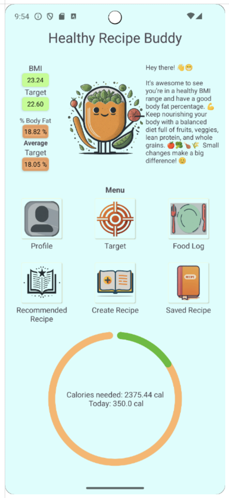

# HealthyRecipeBuddy

**IT816 — Mobile App Development** · Master of Information Technology  

Native Android app for **personalized nutrition tracking**, **goal setting**, and **AI-assisted healthy recipes**. It combines local persistence (Room, `SharedPreferences`), **TDEE-style calorie estimates** (weight, height, age, gender, activity level), and **Google Gemini** (`gemini-1.5-pro-latest`) for greetings and recipe text.

## Download

**[Healthy Recipe Buddy on Huawei AppGallery](https://appgallery.huawei.com/app/C111219819)**

## Screenshot

Main dashboard: BMI and body fat cards, target metrics, Gemini greeting, **Menu** shortcuts (Profile, Target, Food Log, recipes), and the calorie donut (needed vs today’s intake).



---

## Why this app

Modern diets are hard to sustain: too much generic advice, weak personalization, tedious logging, and “what should I cook?” fatigue. HealthyRecipeBuddy narrows that gap by tying **your profile**, **today’s intake**, and **calorie targets** to **one dashboard** and **generative recipe suggestions**—so recommendations stay grounded in what you actually ate and what your metrics suggest.

---

## Objectives (assignment brief)

The app is designed to:

- Support **personalized nutrition tracking** (daily food log, calorie totals).
- Offer **refined guidance** using profile data and targets (BMI, body fat estimates, calorie needs).
- **Inspire healthier meals** via AI-generated recipes (recommended from context, or built from your ingredients).
- Encourage **sustainable habits** through targets, visual progress (donut chart), and supportive messaging.
- Keep the experience **simple to navigate** for routine logging and recipe flows.
- Use **generative AI** where connectivity allows, while keeping core data **on-device**.

---

## Scope & limitations

| Topic | Detail |
|--------|--------|
| **Platform** | **Android only** (native Kotlin). Not intended for iOS or desktop. |
| **Connectivity** | **Gemini features** (main-screen buddy message, recommended recipe, create recipe) need **internet**. |
| **Offline** | **Profile**, **targets**, **food logging**, and **saved recipes** use **local storage** and remain usable without a network (AI calls will not run until you are back online). |
| **Minimum OS** | **`minSdk` 26** (Android 8.0)—see `app/build.gradle.kts`. |

---

## What you get

- **Onboarding & profile** — First-run setup (`UserProfileSettingUpActivity`); later edits and optional **reset-to-onboarding** (`UserProfileEditActivity`).
- **Dashboard** (`MainActivity`) — BMI and body fat (with category styling), target metrics when set, **calories needed** vs **today’s logged calories** on a **Donut** chart, plus an **AI greeting/tips** from Gemini.
- **Set target** (`SetTargetActivity`) — Target weight and **activity level** to drive calorie and target-body-composition calculations.
- **Food log** (`FoodLogActivity`) — Log **meal / dessert / drink** with calories; list refreshes for the current day. **`FoodLogHistoryActivity`** — browse past days (assignment: **up to ~2 months** via calendar-style navigation).
- **Recommended recipe** (`RecommendedRecipeActivity`) — Prompt uses profile, BMI/body fat, today’s foods, intake vs target calories; **regenerate** or **save** with a custom name.
- **Create recipe** (`CreateRecipeActivity`) — Build an ingredient list (with optional quantity/unit), pick type, **generate** via Gemini, **save** or start a **new recipe**.
- **Saved recipes** (`SavedRecipeActivity`) — Persisted in Room; open details in a dialog; delete with confirmation.

---

## Architecture & tech stack

| Layer | Choice |
|--------|--------|
| Language | Kotlin |
| UI | AppCompat, Material, **View Binding**, ConstraintLayout / ScrollView |
| Concurrency | Kotlin coroutines, `lifecycleScope` |
| Local DB | **Room** — `FoodLogDatabase`, `SavedRecipeDatabase` |
| Preferences | `SharedPreferences` (`user_prefs`, flags such as `profile_complete`) |
| AI | [Google Generative AI SDK for Android](https://github.com/google/generative-ai-android) |
| Charts | [Futured Donut](https://github.com/futuredapp/donut) |
| Build | Android Gradle Plugin **8.5.x**, `compileSdk` / `targetSdk` **34** |

Key orchestration: `MainViewModel` holds Gemini calls and `UiState`; `MeasurementTool` centralizes BMI, body fat, and calorie math aligned with the report’s TDEE-oriented framing.

---

## Configuration

1. Copy the template:

   ```bash
   cp app/src/main/res/raw/secrets.properties.example app/src/main/res/raw/secrets.properties
   ```

2. Put your Gemini key on one line (no quotes):

   ```text
   API_KEY=your_gemini_api_key_here
   ```

`MainViewModel` reads the value after `=`. **`secrets.properties` is gitignored**—do not commit real keys.

**If a key was ever exposed (e.g. GitGuardian alert):** revoke it in [Google AI Studio](https://aistudio.google.com/apikey) or [Cloud Credentials](https://console.cloud.google.com/apis/credentials) and use a new key locally only. This repo’s Git history was scrubbed of `secrets.properties`; **revocation is still required** because the old value may have been copied. See [SECURITY.md](SECURITY.md) for details.

---

## Build & run

Open the project in **Android Studio** and run the `app` configuration, or:

```bash
./gradlew assembleDebug
```

---

## Report & attribution

This repository implements the **HealthyRecipeBuddy** prototype described in the coursework report *IT816 Assignment 3* (Mobile App Development): requirements, wireframes, layout implementation, class design, and functional testing (use cases for registration, dashboard, profile reset, targets, food log/history, AI recipes, and saved recipes).

**Author:** Jakkrit Chayngammuang  

If you reuse or cite this project academically, reference your own institution’s rules and the original submission/report where appropriate.
